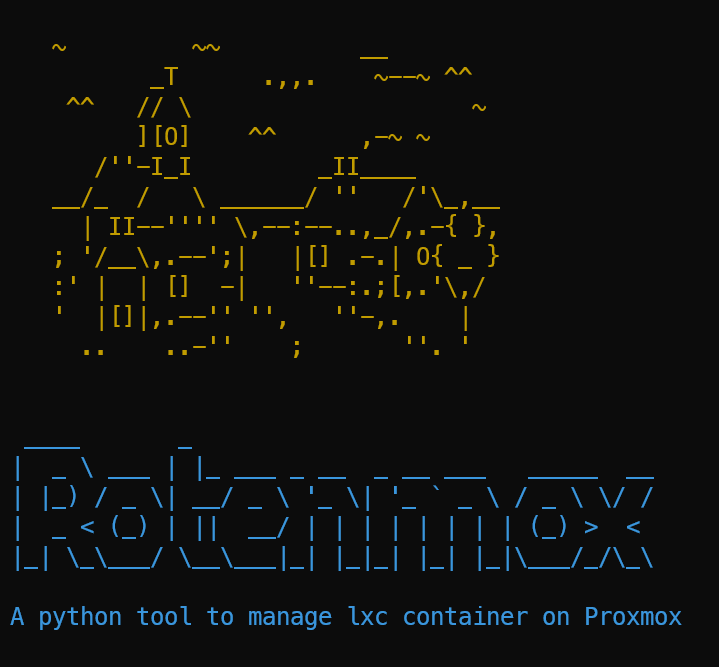
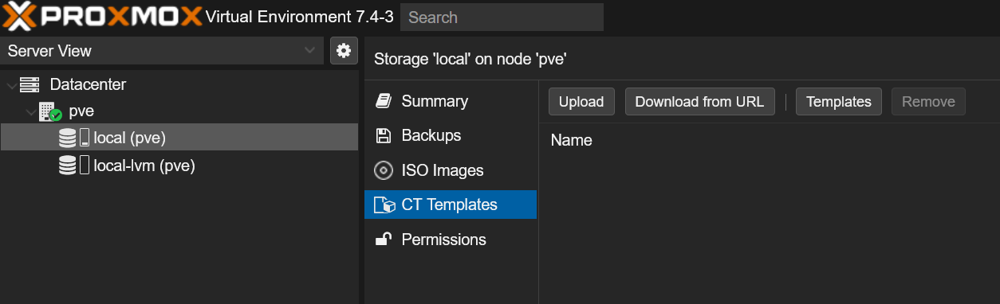
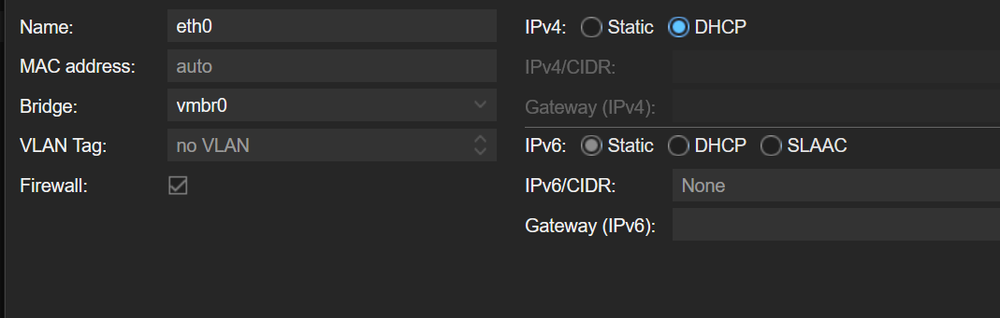

# VIR2



## Table of content

[TOC]

# How to use the CLI (Command Line Interface)

```less
ssh root@proxmoxIp
```

## Create

```less
root@pve:~# python3 ./wrapper.py --task create --number 5
Creating some pentesterlabs
ID : 200 Created
ID : 201 Created
ID : 202 Created
ID : 203 Created
ID : 204 Created
Creating some attacking machines
ID : 300 Created
ID : 301 Created
ID : 302 Created
ID : 303 Created
ID : 304 Created
```

## Start

```less
root@pve:~# python3 ./wrapper.py --task start --number 5
Start some pentesterlabs
ID : 200 IP : 192.168.100.143/24
ID : 201 IP : 192.168.100.147/24
ID : 202 IP : 192.168.100.148/24
ID : 203 IP : 192.168.100.149/24
ID : 204 IP : 192.168.100.150/24
Start some attacking machines
ID : 300 IP : 192.168.100.141/24
ID : 301 IP : 192.168.100.151/24
ID : 302 IP : 192.168.100.152/24
ID : 303 IP : 192.168.100.153/24
ID : 304 IP : 192.168.100.154/24
```

## Stop

```less
root@pve:~# python3 ./wrapper.py --task stop --number 5
Stop some pentesterlabs
ID : 200 Stopped
ID : 201 Stopped
ID : 202 Stopped
ID : 203 Stopped
ID : 204 Stopped
Stop some attacking machines
ID : 300 Stopped
ID : 301 Stopped
ID : 302 Stopped
ID : 303 Stopped
ID : 304 Stopped
```

## Remove

```less
root@pve:~# python3 ./wrapper.py --task remove --number 5
Remove some pentesterlabs
ID : 200 Removed
ID : 201 Removed
ID : 202 Removed
ID : 203 Removed
ID : 204 Removed
Remove some attacking machines
ID : 300 Removed
ID : 301 Removed
ID : 302 Removed
ID : 303 Removed
ID : 304 Removed
```

## List

> It will only show the student lab. For all container, use `pct list`

```less
root@pve:~# python3 ./wrapper.py --task list --number 2
Listing all containers :
200        stopped                 penterlabT
201        stopped                 penterlabT
300        stopped                 attackerT
301        stopped                 attackerT
```

## Errors

The machines are not created

```less
root@pve:~# python3 ./wrapper.py --task start --number 1

==Start some pentesterlabs==
Configuration file 'nodes/pve/lxc/200.conf' does not exist
Configuration file 'nodes/pve/lxc/200.conf' does not exist
Error starting container 200
```

The machines are not running

```less
root@pve:~# python3 ./wrapper.py --task stop --number 1

==Stop some pentesterlabs==
CT 200 not running
Error stopping container 200
```

The machines are not created

```less
root@pve:~# python3 ./wrapper.py --task remove --number 1

==Remove some pentesterlabs==
Configuration file 'nodes/pve/lxc/200.conf' does not exist
ID : 200 Removed
```


# How to use Ansible

```less
root@pve:~# pct start 101
```

```less
root@pve:~# pct exec 101 -- ip addr | grep eth0 | grep inet | awk '{print $2}'
192.168.100.140/24
```

```less
root@pve:~# ssh root@192.168.100.140
```

```
/home
+- /attacker
+---- /attacker.yml
+---- /inventory.cfg
+- /pentesterlab
+---- /attacker.yml
+---- /inventory.cfg
```

## Create new template

```less
root@pve:~# pct clone 100 {newId} --full --storage LXC
```

Get new ip

```less
root@pve:~# pct exec {newId} -- ip addr | grep eth0 | grep inet | awk '{print $2}'
192.168.100.160/24
```

Start ansible machine & get his ip

```less
root@pve:~# pct start 101
root@pve:~# pct exec 101 -- ip addr | grep eth0 | grep inet | awk '{print $2}'
192.168.100.140/24
root@pve:~# ssh root@192.168.100.140
```

Key exchange for the new machine

```less
root@Ansible:~# ssh-keygen root@192.168.100.160
```

> Edit the `.yml` & `.cfg` file

```less
root@Ansible:~# ansible-playbook -i inventory.cfg attacker.yml
```

Convert the new LXC to template

```less
root@pve:~# pct template {newId}
```

> Then edit the wrapper.py with the id 

```python
def main(ARGV):
    pentesterlab = 103
    attacking = 102
```

# Installation documentation

## Need

| Machine | Tools                    |
| ------- | ------------------------ |
| Student | ssh client & web browser |
| Teacher | ssh client & Proxmox     |


## Install proxmox

**Why using Proxmox ?**

> Proxmox as native support for linux container and has a easy to use cli to manage them. That's why it's the best solution for our needs. 

1. Install Proxmox
   https://www.proxmox.com/en/downloads/category/iso-images-pve
2. Download template



3. Configure network



## Create SSH Template

> You only need 2 GB storage

To do on the new container

```
apt update
apt upgrade
```

Edit `/etc/ssh/sshd_config`

```
PermitRootLogin yes
```

Convert to template. 

## Create Ansible container

**Why using Ansible ?**

> Ansible is one of the best automation tools for configuration deployment. It makes modification of the config on the machines very easy. 

Clone ssh template

To do on the new container

```less
apt update
apt upgrade
apt install python3-pip
python3 -m pip install --user ansible
echo 'export PATH="$HOME/.local/bin:$PATH"' >> ~/.bashrc 
source .bashrc
ansible-galaxy collection install community.mysql
```

## Create Pentesterlab Template

Clone ssh template

From ansible box :

```
ssh-keygen
ssh-copy-id root@pentesterlabIP
```

`inventory.cfg`

```
pentesterlabIP ansible_user=root
```

`pentesterLab.yml`

```yaml
---
- hosts: all
  become: yes
  tasks:
    - name: update & upgrade
      apt:
        upgrade: yes
        update_cache: yes

    - name: enable Root Login
      lineinfile:
        dest: /etc/ssh/sshd_config
        regexp: '^PermitRootLogin'
        line: "PermitRootLogin yes"
        state: present
        backup: yes
      notify:
      - restart ssh

    - name: install iptables
      apt:
        name: iptables
        state: latest

    - name: install php
      apt:
        name: php
        state: latest

    - name: install apache2
      apt:
        name: apache2
        state: latest

    - name: install php-mysqli
      apt:
        name: php-mysqli
        state: latest
      notify:
      - restart apache2

    - name: install mariadb-server
      apt:
        name: mariadb-server
        state: latest

    - name: install git
      apt:
        name: git
        state: latest

    - name: install pip3
      apt:
        name: python3-pip
        state: latest

    - name: Remove index.html
      ansible.builtin.file:
        path: /var/www/html/index.html
        state: absent

    - name: Clone the shop
      ansible.builtin.git:
        repo: https://github.com/7ric/Photoblog.git
        dest: /var/www/html/
        update: no

    - name: Make sure pymysql is present
      become: true # needed if the other tasks are not played as root
      pip:
        name: pymysql
        state: present

    - name: Create new databases photoshop
      community.mysql.mysql_db:
        login_unix_socket: /var/run/mysqld/mysqld.sock
        state: import
        target: /var/www/html/photoblog.sql
        name: all
      ignore_errors: true


    - name: Change file permission
      file:
        path: /var/www/html/
        owner: www-data
        group: www-data
        recurse: true
        
    - name: display_errors
      lineinfile:
        dest: /etc/php/7.4/apache2/php.ini
        regexp: '^display_errors = Off'
        line: "display_errors = On"
        state: present
        backup: yes
        
    - name: disable_functions
      lineinfile:
        dest: /etc/php/7.4/apache2/php.ini
        regexp: '^disable_functions'
        line: "; disable_functions"
        state: present
        backup: yes
      notify:
      - restart apache2

  handlers:
    - name: restart ssh
      systemd:
        name: sshd
        state: restarted
    - name: restart apache2
      systemd:
        name: apache2
        state: restarted
```

Run the playbook

```
ansible-playbook -i inventory.cfg pentesterLab.yml
```

Convert to template.

## Create Attacking Template

Clone ssh template

From ansible box :

```
ssh-keygen
ssh-copy-id root@AttackingIp
```

`inventory.cfg`

```
AttackingIp ansible_user=root
```

``attacker.yml`

```yaml
---
- hosts: all
  become: yes
  tasks:
    - name: update & upgrade
      apt:
        upgrade: yes
        update_cache: yes

    - name: enable Root Login
      lineinfile:
        dest: /etc/ssh/sshd_config
        regexp: '^PermitRootLogin'
        line: "PermitRootLogin yes"
        state: present
        backup: yes

    - name: restart ssh
      systemd:
        name: sshd
        state: restarted

    - name: install nmap
      apt:
        name: nmap
        state: latest

    - name: install sqlmap
      apt:
        name: sqlmap
        state: latest

    - name: install curl
      apt:
        name: curl
        state: latest

    - name: install lynx
      apt:
        name: lynx
        state: latest

    - name: install netdiscover
      apt:
        name: netdiscover
        state: latest

    - name: install crunch
      apt:
        name: crunch
        state: latest

    - name: install patator
      apt:
        name: patator
        state: latest

    - name: install weevely
      apt:
        name: weevely
        state: latest
```

Run the playbook

```
ansible-playbook -i inventory.cfg attacker.yml
```

Convert to template.

## CLI (Command Line Interface)

**Why using python ?**

> Python is already installed on most Linux machines and it's easier to read and maintain that a bash script

Install requirement

``` less
apt install python3-pip
pip install absl-py
```

`wrapper.py`

```python
import os
import time
from absl import app
from absl import flags

FLAGS = flags.FLAGS

flags.DEFINE_enum('task', None, ['start', 'stop','create','remove','list'], 'Task to do')
flags.DEFINE_integer('number', None, 'Number of instance')

def getIP(id):
    cmd = f"pct exec {id}"+" -- ip addr | grep eth0 | grep inet | awk '{print $2}'"
    ip = os.popen(cmd).read()
    return ip

def startLxc(id):
    cmd = f"pct start {id}"
    out = os.system(cmd)
    return out

def stopLxc(id):
    cmd = f"pct stop {id}"
    out = os.system(cmd)
    return out

def clone(id, newId):
    cmd = f"pct clone {id} {newId} --full --storage LXC"
    out = os.popen(cmd).read()
    return out

def list():
    cmd = 'pct list | grep "[2-9][0-9]"'
    out = os.popen(cmd).read()
    return out

def remove(id):
    cmd = f"pct destroy {id}"
    out = os.system(cmd)
    return out

def banner():
    TGREEN =  '\033[33m'
    TBLUE = '\033[36m'
    ENDC = '\033[m'
    print(TGREEN + """\

    ~         ~~          __
           _T      .,,.    ~--~ ^^
     ^^   // \                    ~
          ][O]    ^^      ,-~ ~
       /''-I_I         _II____
    __/_  /   \ ______/ ''   /'\_,__
      | II--'''' \,--:--..,_/,.-{ },
    ; '/__\,.--';|   |[] .-.| O{ _ }
    :' |  | []  -|   ''--:.;[,.'\,/
    '  |[]|,.--'' '',   ''-,.    |
      ..    ..-''    ;       ''. '

  """, ENDC)

    print(TBLUE + """\
  ____       _
 |  _ \ ___ | |_ ___ _ __  _ __ ___   _____  __
 | |_) / _ \| __/ _ \ '_ \| '_ ` _ \ / _ \ \/ /
 |  _ < (_) | ||  __/ | | | | | | | | (_) >  <
 |_| \_\___/ \__\___|_| |_|_| |_| |_|\___/_/\_\\\


 A python tool to manage lxc container on Proxmox

    """, ENDC)

def main(ARGV):
    pentesterlab = 103
    attacking = 102

    banner()


    if FLAGS.task == None:
        print("Invalid argument. Use --help to show help")
        return
    if FLAGS.task == "list":
        print("Listing all containers :")
        out = list()
        print(out)
        return
    if FLAGS.number == None:
        print("Invalid argument")
        return
    if FLAGS.task == "start":
        print("\n==Start some pentesterlabs==")
        for x in range(200,200+FLAGS.number):
            out = startLxc(x)
            #Wait for dhcp
            time.sleep(7)
            ip = getIP(x)
            if out == 0:
                print(f"ID : {x} IP : {ip}".rstrip())
                print("Username: root   Password: Pa$$w0rd")
            else:
                print(f'Error starting container {x}')


        print("\n==Start some attacking machines==")
        for x in range(300,300+FLAGS.number):
            out = startLxc(x)
            #Wait for dhcp
            time.sleep(7)
            ip = getIP(x)
            if out == 0:
                print(f"ID : {x} IP : {ip}".rstrip())
                print("Username: root   Password: Pa$$w0rd")
            else:
                print(f'Error starting container {x}')
        return
    if FLAGS.task == "stop":
        print("\n==Stop some pentesterlabs==")
        for x in range(200,200+FLAGS.number):
            out = stopLxc(x)
            if out == 0:
                print(f"ID : {x} Stopped")
            else:
                print(f'Error stopping container {x}')

        print("\n==Stop some attacking machines==")
        for x in range(300,300+FLAGS.number):
            out = stopLxc(x)
            if out == 0:
                print(f"ID : {x} Stopped")
            else:
                print(f'Error stopping container {x}')
        return
    if FLAGS.task == "create":
        print("\n==Creating some pentesterlabs==")
        for x in range(200,200+FLAGS.number):
            out = clone(pentesterlab,x)
            print(f"ID : {x} Created")

        print("\n==Creating some attacking machines==")
        for x in range(300,300+FLAGS.number):
            out = clone(attacking,x)
            print(f"ID : {x} Created")
        return
    if FLAGS.task == "remove":
        print("\n==Remove some pentesterlabs==")
        for x in range(200,200+FLAGS.number):
            out = remove(x)
            print(f"ID : {x} Removed")

        print("\n==Remove some attacking machines==")
        for x in range(300,300+FLAGS.number):
            out = remove(x)
            print(f"ID : {x} Removed")
        return


if __name__ == "__main__":
    app.run(main)
```

